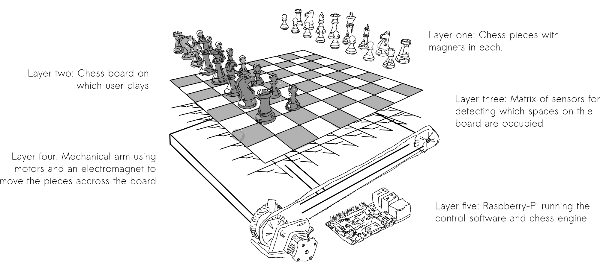
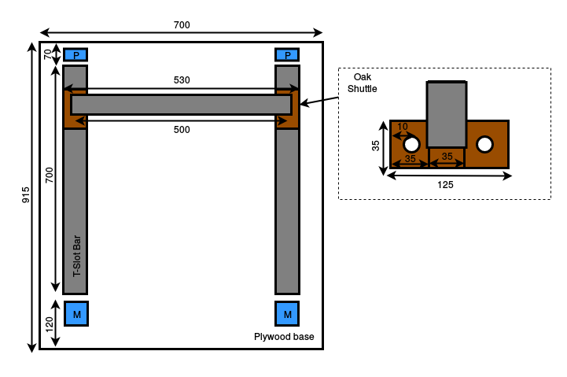
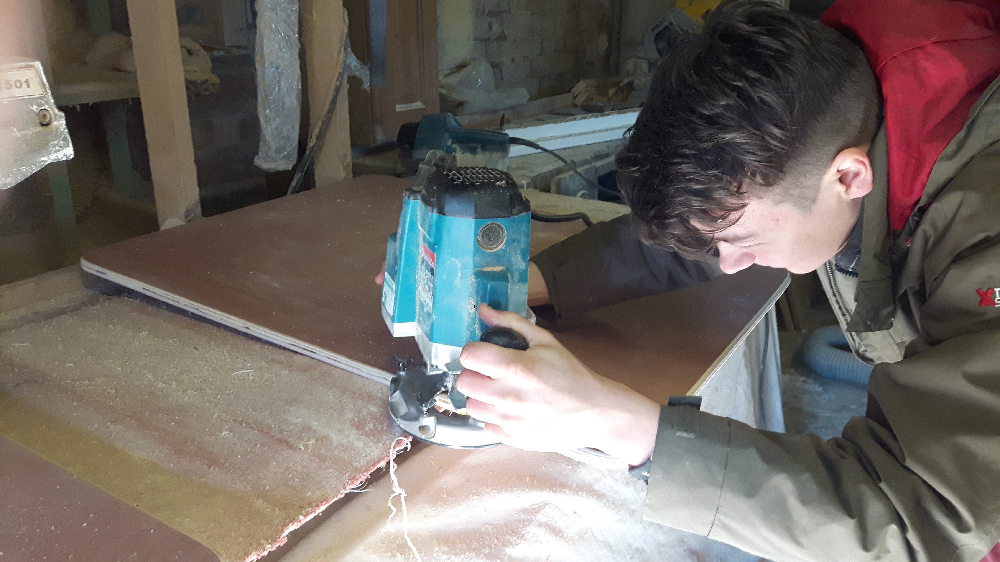
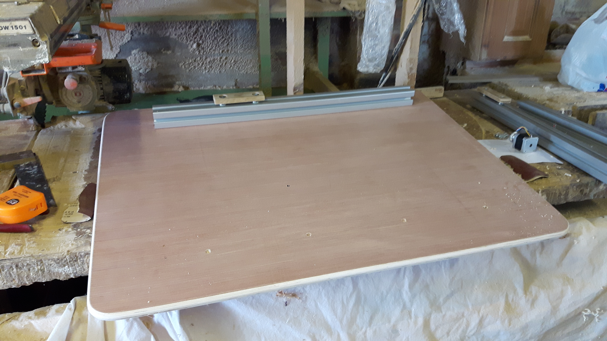
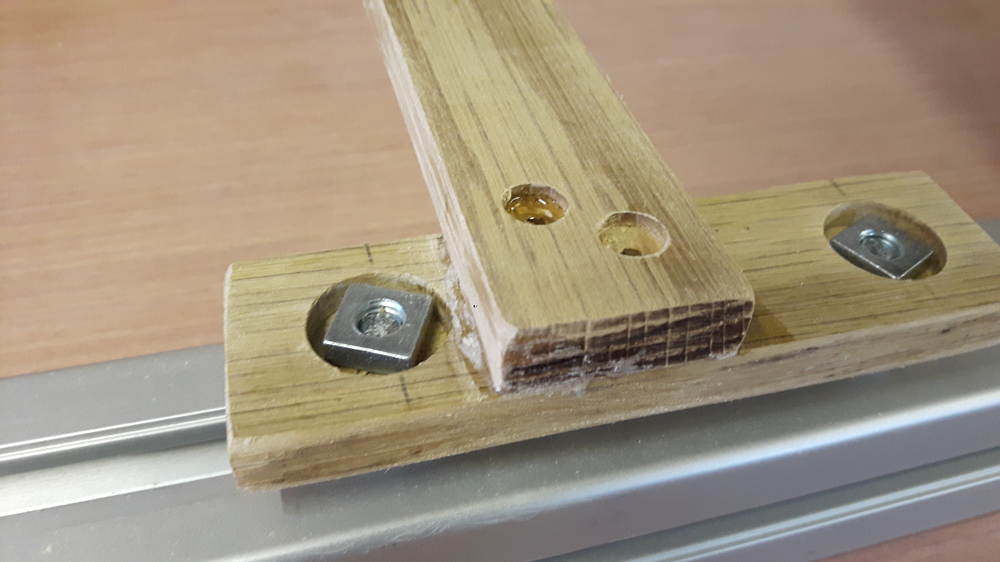
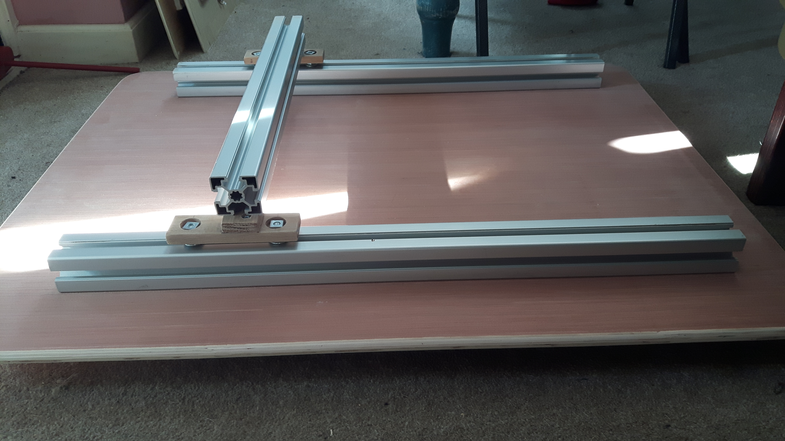
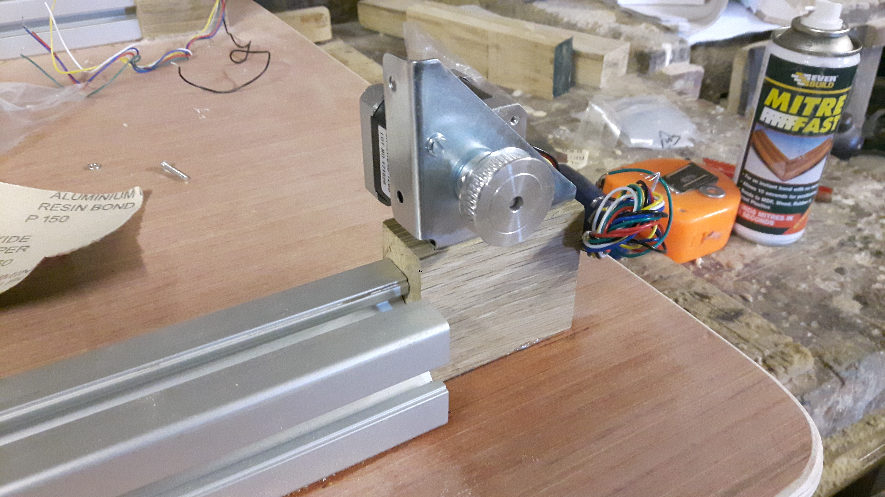
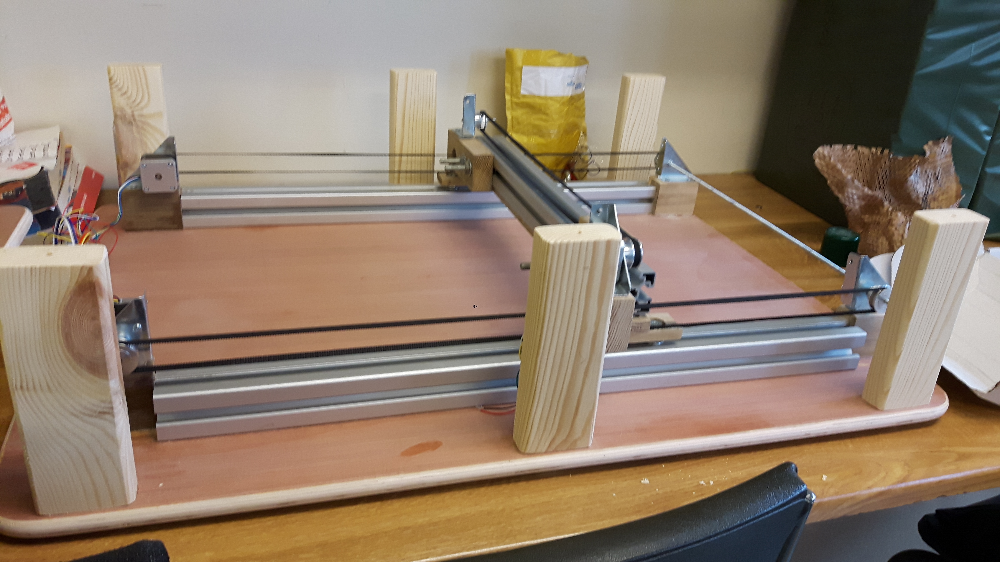
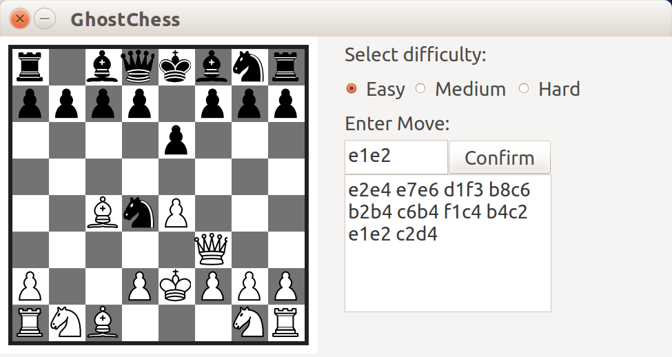

# team11_RTEP5: Mechanised User vs. Computer Chess Board
Computer chess engines have become very advanced and are great for learning how to play or for improving your skills. However, playing on a computer is just not the same as seeing the physical pieces move across the board!

This project aims to design and build a mechanised chess device, allowing users to play against the StockFish chess engine on a physical board. An X-Y positioning table will use an electromagnet to execute the computer-generated moves, moving the physical pieces across the board, mimicking a real chess expert.



# Why?
Playing games on a computer screen can be great - but it takes away from the game. Ghost Chess allows users to detach from their everyday computer use to really invest in the game itself, providing a more engaging gaming experience. Variable difficulty levels allow users to improve their chess skills. Not to mention that it is really cool!

## Table of Contents
[Getting Started](#getting_started)
  * [Required Hardware](#required_hardware)
  * [Assembling the mechanical arm](#mechanical_arm)
  * [Building Software](#building_software)
  * [Motor Control](#motor_control)
  
[System Specification](#system_specification)

[Project Progress/Evaluation](#progress_evaluation)
  * [Team Roles](#team_roles)

[FAQ/Common Issues](#faq)

# Getting Started <a name="getting_started"></a>
All project-related software can be found in folder "src", and all required schematics/CAD files/PCB designs/footprints are located in folder "Docs".
## Required Hardware <a name="required_hardware"></a>
* The full [Bill of Materials](goo.gl/mntyCQ): 
X-Y positioning:
* 3x Stepper Motors (Nema 17)
* 3x Stepper motor drivers (Pololu A4988)
* 1x Electromagnet (3/4' Diameter, 4.5kg pull force) and 40x Button Magnets (3mm diameter, 2mm height)
* P36NF06L FET
* 2x 700/900 mm plywood sheets
* 2x 700mm and 1x 500mm T-slot bar
* 3x 125mm oak shuttles
* 6x T-bolts
* 1x 500mm oak bar
* 6x 40T GT2 6mm Timing Pulley
* 5M 6mm GT2 fiber-glass re-enforced rubber timing belt
* 1x 500mm metal shaft and 1x 30mm metal shaft
* 6x Flanged Corner Bracket BZP

Sensor Matrix:
* 72x Latching Hall-effect Sensors (SS361RT) and 72 10kohm resistors
* 2x 8-1 FET Mux/Demux (SN74CBT3251)

Other:
* Laser-cut Acrylic chess board and 3D printed pieces
* Raspberry Pi 3 Model B

# Assembling the mechanical arm: <a name="mechanical_arm"></a>


All measurements in mm.

A Plywood base is used to ensure that there is no unwanted lateral motion under tension. T-slot bars act as runners for oak shuttles, held in place by T-bolts. The Y plane movement is supported by two T-slot bars, each 700mm in length. Mounted to both the Oak shuttles on the Y plane is an oak bar which holds the 3rd, X plane, T-slot bar in place (500mm in length). Each shuttle is moved using a timing belt which is mounted through 2 pulleys to a stepper motor.

.jpg)

1. Cut and bevel the two 915mm/70mm Plywood sheets which form the base and top plate of the design


2. Bolt down the 2 700mm length T-slot bars through the base plywood sheet (4 bolts spaced evenly)


3. Cut the 3 125mm/35mm oak shuttles and the 500mm/35mm oak cross bar
4. Mount the oak cross bar to two of the oak shuttles using miter-fast bond and screws


5. Bolt the 500mm T-slot bar to the oak cross bar (4 bolts spaced evenly)


6. Cut oak blocks to stand the pulleys and motors (x6, 3 for motors and 3 for pulleys), plane to match heights (the bottom of the pulleys should be at the same height as the top of the oak shuttles to ensure that the timing belt can be fixed securely)
7. Fix the oak blocks to the plywood base using miter fast bond and screws


8. fix the flaged corner brackets to the oak blocks, ensuring they are parallel to the T-slot bar and in line
9. attach the motors to the flanged corner brackets by drilling holes in the corner bracket and bolting the motors through them
10. attach pulleys to motor shafts, 500mm metal shaft, and 30mm metal shaft


11. attach timing belt to oak shuttles through pulleys with tension using miter fast bond



### Electromagnet

The electromagnet is controlled using a GPIO on the RASPI, connected to the gate of a N-Channel FET (P36NF06L) with a R10k to GND. 12V DC from the power supply connected Electromagnet with the other connection to the Drain of the FET and the Source to GND.

# Sensor matrix: detecting the users move

# Building Software <a name="building_software"></a>

To build this project's software: first clone the repository then run

```
cd GhostChess
cmake .
make

./GhostChess

```
**NB** Requires QT5, to install:
```
sudo apt-get install qt-5 default
```
Moves can be entered through the GUI or through the CLI (both entered in Algerbraic Chess Notation eg e2e4...).
## Software Flow:

The software forms an interface between the user and the StockFish API, updating the API with new moves and reading out the computers moves to pass to the motor control software. A full software flow diagram can be found in [Docs/Software_flow_diagram](Docs/Software_flow_diagram.png).

## Motor control: <a name="#motor_control"></a>

Motor control is performed using digital GPIO outputs which control the Pololu A4988 stepper motor driver. The stepper motors are rotated in 4 stages which relates to 4 configurations of the H-bridge inductor which is used to turn the motor shaft. A single rotation therefore relates to:

To move pieces accross the board the control software performs the following steps:
1. Move to coordinate y1 x1 (the coordinate of the piece to be moved)
2. Turn on electro magnet
3. Move to edge of square (to ensure that the peice being moved will not collide with any pieces in surrounding squares)
4. Move to coordinate y2 x2 (the space to be moved to)
5. Return piece to the centre of the square
6. Return to origin of the board (located at square A1)

# System Specification <a name="system_specification"></a>

Responsiveness of the system. How long the system will take to move a piece.
Latency permitted for the piece -> dependant on where the piece has to move (
Sampling rate of 2Hz for board state of 64 elements.
Thread will poll the board every 2Hz and check for changes/validate and make sure user has moved a piece correctly then the engine will respond.
Bus Protocol, communicating to motor drivers.
Channels? 1
Kernel space usage was not deemed necessary since the latencies were in the order of seconds/ms. For simpicity and faster development time then staying in user space was preferred.
Data flow  is shown in the [software diagram](Docs/Software_flow_diagram.png) (formats, latencies, processing and conversions)
Buffers for the move history of the game as well as the engines returned moves are stored.
 
Threads operate for fetching the user input for the CLI as well. The board array will also be updated using a thread executed at 2Hz.

### Team Roles <a name="team_roles"></a>
* Alex Angelov - 3D Pieces Modelling, Board Production, Position Sensing and Related Software
* Tim Ness - Design Assembly, Accurate Motor Control and Related Software
* Alex Smith - Chess Engine Integration and QT GUI Interface

# Progress Success Evaluation <a name="progress_evaluation"></a>
Issue tracking and Project Tracking through github's associated tools.

How does the project acheive the goals that are set out above?

# FAQ/Common Issues <a name="faq"></a>
**Q:** QLabel: No such file or directory

**A:** QT5 must be installed to build the software, run  ```sudo apt-get install qt-5 default ```

